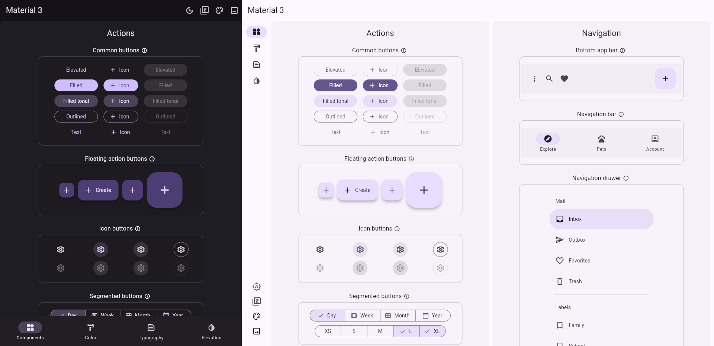

# Flutter 开发编译打包

## 预览截图



## 1. 项目初始化

```bash
flutter pub get
```

## 2. 项目运行

```bash
flutter run -d web-server --web-port 8888
```

## 3. 项目打包

- web
```bash
flutter build web
```

- apk
```bash
flutter build apk --split-per-abi
```